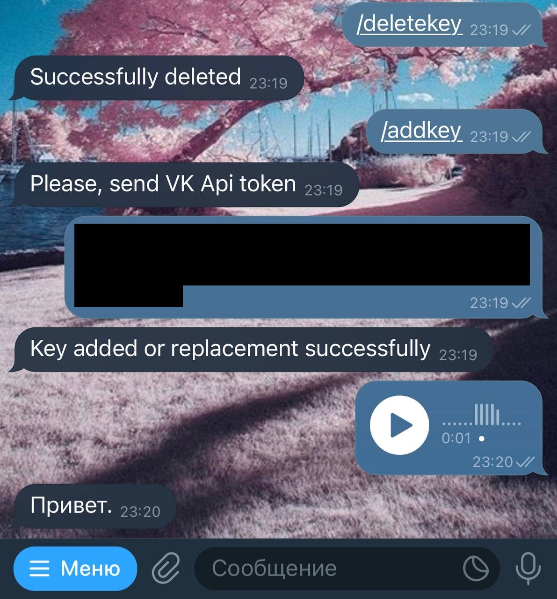

# TgVoiceReader
Telegram bot for extracting text from a voice message.

## Usage bot:
- get [VK service key](https://dev.vk.com/api/access-token/getting-started#:~:text=%D0%BA%D0%BB%D1%8E%D1%87%20%D0%B4%D0%BE%D1%81%D1%82%D1%83%D0%BF%D0%B0.-,%D0%A1%D0%B5%D1%80%D0%B2%D0%B8%D1%81%D0%BD%D1%8B%D0%B9%20%D0%BA%D0%BB%D1%8E%D1%87%20%D0%B4%D0%BE%D1%81%D1%82%D1%83%D0%BF%D0%B0,-%D0%A1%D0%B5%D1%80%D0%B2%D0%B8%D1%81%D0%BD%D1%8B%D0%B9%20%D0%BA%D0%BB%D1%8E%D1%87%20%D0%BD%D1%83%D0%B6%D0%B5%D0%BD)
- Send command `/addkey` to [@SecondEarsBot](http://t.me/SecondEarsBot)
- Send VK api key. Send any symbol for canceling
- Forward messages to bot and enjoy

For using in ChatGroup add bot to group and run the command `/addkey`

If you want to replace your VK api key, run the command `/addkey` too

For deleting VK api key from bot, run the command `/deletekey`

## Hosting bot
### Docker-compose
- Create `.env` with the following contents:

        pg_pas=your_pass_for_db
        tg_token=token_for_your_bot
        bot_name=name_of_bot

- Run `docker-compose --env-file .env up`

### Manually
- Install PostgreSQL 14.1 and create database
- Install jdk 8, kotlin 1.7.20 and Gradle 7.6
- Build project and run with env variables:

        POSTGRES_USER = postgres_user
        POSTGRES_PASSWORD = postgres_pas
        POSTGRES_DB = ndb_name
        TG_TOKEN = tg_token
        HOST = ipdb:portdb
        BOT_NAME = bot_name